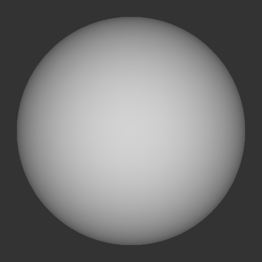
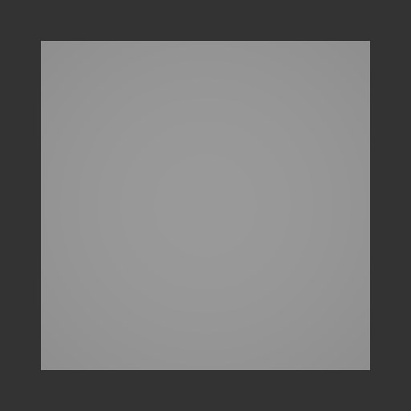
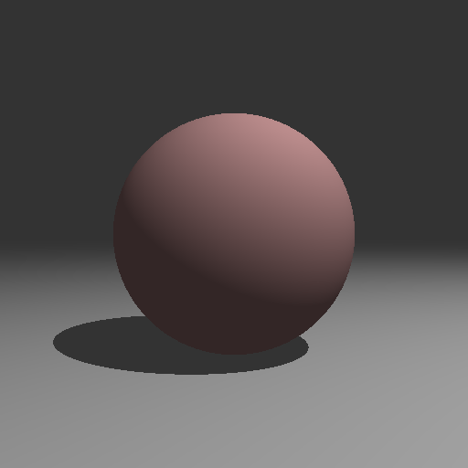
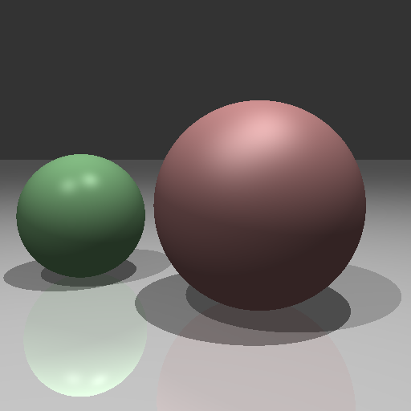

## Example Output images: 
  
P02_01_sphere   
</img>

P02_02_sphere_ambient   
</img>

P02_03_quad   
</img>

P02_04_quad_room   
</img>

P02_05_ball_on_plane   
</img>

P02_06_balls_on_plane   
</img>

P02_07_reflections   
</img>

P02_08_antialiasing   
</img>

P02_10_creative_artifact
</img>
